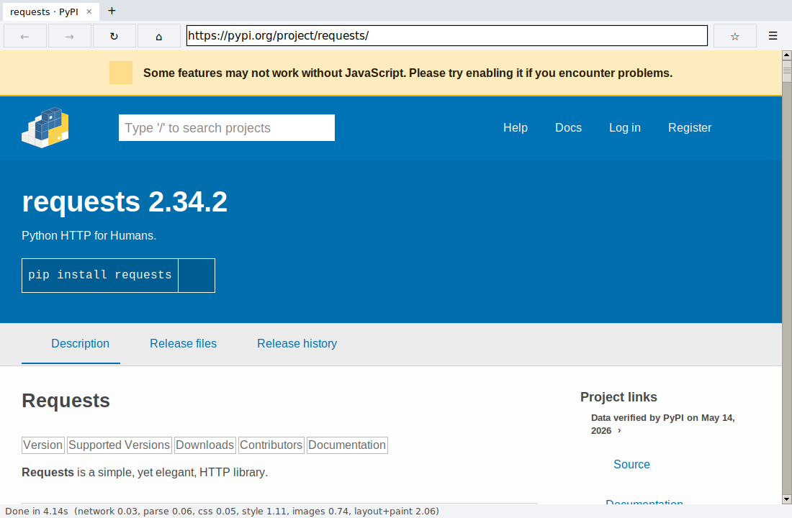

# Net Surfer


A desktop web browser written from scratch in Python. It fetches pages over
HTTP/HTTPS, parses HTML into its own document tree, runs its own CSS cascade,
lays the page out with its own block/inline/float/table/flex/grid layout
engine, and paints the result onto a Tk canvas. Page scripts run in a
sandboxed JavaScript interpreter (the QuickJS library) against a DOM and Web
API layer we wrote ourselves. No browser engine, WebView or headless browser
is used anywhere.



## Running it

**Operating system:** developed and tested on Linux (Ubuntu 24.04, Python 3.12).
It uses only cross-platform pieces (Tkinter, Pillow), so it should also run on
macOS and Windows with the Python from python.org, which includes Tk.

**Dependencies:** Python 3.9+ with Tkinter, plus Pillow for image decoding and
`quickjs` for running page scripts (without it the browser still works and
simply skips scripts).

```bash
python3 -m pip install -r requirements.txt     # installs Pillow and quickjs
py -3.12 run_browser.py
```

On Debian/Ubuntu, Tkinter is a separate package: `sudo apt install python3-tk`.
Double-click launchers are included: `Net Surfer.pyw` (Windows) and
`run_browser.command` (macOS).

**Using it:** type a URL (or words to search) in the address bar and press
Enter. Scroll with the wheel, scrollbar, arrow keys, Page Up/Down, Space,
Home/End. Click links; Ctrl-click or `target=_blank` opens a new tab.
Back/forward/reload are the toolbar arrows, Alt+Left/Right and F5.
Ctrl+T/Ctrl+W open/close tabs, Ctrl+L focuses the address bar, Ctrl+U shows
the page source, F12 opens the DOM/style inspector, Ctrl+D bookmarks.

## What it supports

| Area | Supported |
|---|---|
| Networking | HTTP/1.1 and HTTPS, redirects (301/302/303/307/308, up to 10), relative URL resolution, gzip/deflate, chunked bodies, cookies (Domain/Path/Max-Age), a subresource cache, GET and POST, `data:`, `file:` and `about:` URLs, `HTTPS_PROXY`, charset detection (header, `<meta charset>`, BOM). Failures become an error page rendered by the browser itself. |
| HTML | Hand-written tokenizer and tree builder: implied `<html>/<head>/<body>`, void elements, raw text (`<script>`, `<style>`, `<textarea>`), entities, comments, implied end tags (`<p>`, `<li>`, `<td>`, `<tr>`...), recovery from mismatched tags, SVG self-closing tags. |
| CSS | `<link>` and `<style>` sheets, `@import`, `@media` (width/height/aspect-ratio/orientation, range syntax, `calc()`), `@supports` (evaluated), `@layer` ordering, `@container` queries and `cq*` units, CSS nesting, `@property`, `@counter-style`, `@scope`, `@keyframes`, `style=""`. Selectors: type, class, id, universal, attribute (`= ~= ^= $= *= \|=`), descendant, child, `+`, `~`, `:first-child`, `:last-child`, `:nth-child()`, `:not()`, `:is()`, `:root`, `:link`, `:hover`, `:focus`, `:focus-visible`, `:focus-within`, `:checked` (so CSS-only checkbox dropdowns like Wikipedia's open when their label is clicked), `:has()`, `:target`, `:lang()`, `:only-of-type`, `:nth-last-of-type`, `:placeholder-shown`, `:required`, `:valid/:invalid`, `:dir()`, `::first-letter`, `::first-line`, `::marker`, `::placeholder`, `::selection` and more (hover/focus changes restyle only the affected subtree and repaint, or relayout when sizes change). Cascade by origin, `!important`, specificity and source order; inheritance; `inherit/initial/unset`; custom properties with `var()`; `calc()` and the other math functions (`min/max/clamp/round/mod/rem/abs/sign`, trig, `pow/sqrt/hypot/log/exp`); `attr()` in any property; em/rem/%/vw/vh/pt units; named, hex, rgb(a), hsl(a), hwb, lab, lch, oklab, oklch, `color()`, `color-mix()`, `light-dark()` colours; CSS counters; `::before/::after` generated content; shorthands (margin, padding, border, background, font, flex, gap, grid, grid-template, grid-area, list-style...). |
| Layout | Block layout with the box model, `box-sizing`, auto margins, min/max sizes and vertical margin collapsing; inline layout with line wrapping, `white-space`, `text-align`, `line-height`, `vertical-align` (baseline/middle/sub/super), inline backgrounds/borders; inline-block; floats with `clear` and text flowing around them; lists with bullets and numbers; tables (auto column widths, colspan, `border-collapse`, legacy `border/cellpadding`); flexbox (row/column and reverse, wrap/wrap-reverse, the full grow/shrink resolution with min/max sizes, auto margins, justify-content, align-items/align-self incl. baseline, align-content, gap, order); grid (`grid-template-columns/rows` with px/%/fr/auto/min-content/max-content/`minmax()`/`fit-content()`/`repeat()` incl. auto-fill/auto-fit, `grid-template-areas` and `grid-area`, line numbers/names/spans, auto-placement incl. column flow and dense, implicit tracks via `grid-auto-rows/columns`, gaps, justify/align of items and tracks); `position: relative/absolute/fixed/sticky` (fixed and sticky boxes stay on screen while scrolling); multi-column layout (`columns`, `column-count/width/gap/rule`); `aspect-ratio`; table `rowspan`; `overflow-wrap`/`word-break`, `text-overflow: ellipsis`, `text-align: justify`, `letter-spacing`, `word-spacing`; `overflow: auto/scroll` boxes that scroll with the mouse wheel; stacking contexts and `z-index`; subgrid and masonry; `table-layout: fixed`, `<col>` widths, `caption-side`; `column-span`; hyphenation, `line-clamp`, `text-wrap: balance/pretty`; right-to-left text and `writing-mode` (vertical text); 2D transforms (`rotate/scale/skew/matrix`, individual properties, `transform-origin`); CSS transitions and `@keyframes` animations; `scroll-behavior`, `scroll-snap`, `scroll-margin`; text selection (`user-select`, Ctrl+C), `resize` handles, `pointer-events`; `overflow: hidden` clipping; `visibility`, `opacity: 0`. |
| Painting | Backgrounds (colours, images with repeat/size/position, linear/radial/conic/repeating gradients), `border-radius`, `box-shadow`, `outline`, dotted/dashed/double borders, partial `opacity`, translucent colours (stippled), multiple background layers with clip/origin/attachment, `border-image`, `text-shadow`, wavy/dotted/double decorations, `filter`, `backdrop-filter`, `mix-blend-mode`, `clip-path`, `mask-image` (single-colour icons drawn through an SVG/PNG mask, as Wikipedia does), borders (solid and 3-D styles), text with decorations, images (PNG, JPEG, GIF, WebP, BMP via Pillow), and SVG (own rasterizer: paths incl. arcs, shapes, transforms, fills/strokes, `<use>`), both as ``/CSS backgrounds and inline `<svg>`. |
| Browsing | Tabs, address bar, back/forward/reload/home, scrolling, clickable links with hover URLs, `#fragment` scrolling, forms (text, password, checkbox, radio, select, textarea, submit/Enter; GET and POST), bookmarks, view-source, a DOM/style inspector, a per-page network log, and per-stage timings in the status bar. |
| JavaScript | Inline and external `<script>`s in document order (defer/async after the rest), scripts inserted by script, `DOMContentLoaded`/`load`/`readystatechange`, `document.write` during load. DOM: `document`/elements/text nodes, `getElementById`, `querySelector(All)`, `matches`/`closest` (our own selector engine), create/append/insert/remove/clone, `innerHTML`/`outerHTML`/`insertAdjacentHTML` (our own HTML parser and serializer), attributes, `classList`, `dataset`, `style`, `getComputedStyle`, `getBoundingClientRect`/`offsetWidth` (from our layout), form `value`/`checked`/`selectedIndex`, `FormData`. Events: `addEventListener` with capture/bubble, `onclick` properties and `onclick=""` attributes, `preventDefault` (cancels link clicks and form submits), trusted mouse/keyboard/input/change/submit events from the window, `javascript:` links. Timers (`setTimeout/setInterval/requestAnimationFrame`), promises, `fetch` and `XMLHttpRequest` (same origin only), `localStorage`/`sessionStorage`, `location` (navigation), `history.back()`, `URL`/`URLSearchParams`, `console` (to the network log), `atob/btoa`, `TextEncoder`, `crypto.getRandomValues`. Enough to run jQuery and Wikipedia's own scripts. Demo and self-check: `about:js`. |

**Not supported:** JavaScript modules (`type="module"`), canvas, shadow DOM, synchronous XHR,
cross-origin `fetch` (no CORS), web fonts (`@font-face`; text uses installed fonts), 3D transforms (flattened to 2D),
printing (`@page`), floats inside tables, video/audio, and `<iframe>`. Large single-page apps
built on frameworks may not run fully.

## How a page travels through the browser

```
 URL typed / link clicked                                    browser/gui.py
        │
        ▼
 network.fetch()  ── URL parsing & resolution, redirects,       browser/network.py
        │            cookies, cache, gzip, charset
        ▼
 html_parser.parse() ── tokens → DOM tree (dom.Element/Text)     browser/html_parser.py, dom.py
        │
        ▼
 js.ScriptHost ── runs <script>s in a sandboxed script process   browser/js.py, js_prelude.js,
        │          (QuickJS); DOM calls come back to our tree      js_worker.py
        ▼
 engine: find <link>/<style>, fetch CSS in parallel,             browser/engine.py
        │   css_parser → rules (selectors + declarations)         browser/css_parser.py
        ▼
 style.StyleEngine ── cascade + inheritance → computed style      browser/style.py
        │              on every node; ::before/::after created
        ▼
 engine: fetch & decode images (Pillow; SVG by svg.py)           browser/engine.py, svg.py
        │        ── everything above runs on a worker thread ──
        ▼
 layout.DocumentLayout ── box tree → positions and sizes          browser/layout.py
        │   (block, inline/lines, float, table, flex, grid, abs)
        ▼
 paint ── display list of rect/text/line/image commands           browser/paint.py
        │
        ▼
 Tk canvas draws the commands; clicks are hit-tested against     browser/gui.py
 the display list to find links and form controls
```

**What the code owns vs. what libraries provide.** Libraries: `http.client`
and `ssl` (socket, TLS and HTTP framing), `gzip/zlib`, `tkinter` (window,
widgets, font measurement, drawing primitives on a canvas) and Pillow (decoding
raster images and filling polygons), and QuickJS through the `quickjs` package
(the JavaScript language only: parsing and running JS code, objects, closures,
promises). Everything else is ours: URL resolution, redirects, cookies,
caching, the HTML parser, CSS parser, selector matching, cascade, all layout
algorithms, the painter/display list, hit testing, forms, history, tabs, the
SVG rasterizer, and the whole DOM and Web API that scripts see (document,
elements, events, timers, fetch, storage, location), which is implemented in
`js_prelude.js` and `js.py` on top of our own tree, selector engine, HTML
parser and network code.

## JavaScript and the sandbox

The `quickjs` package bundles a 2021 QuickJS. `js_rewrite.py` works around its
one compiler bug that real sites hit (a `yield` inside an expression in a
generator's `try`/`finally`, which Google's main script contains) by moving
that block into an inner generator, and the prelude fills in APIs it predates
(`WeakRef`, `FinalizationRegistry`, `AbortController`, `document.fonts`).

Every page script is treated as hostile. How the browser contains it:

* **Separate process.** Each page with scripts gets its own script process
  (`js_worker.py`), which runs QuickJS and nothing else; it does not import the
  browser. Scripts in different tabs or pages share nothing.
* **One narrow door.** The only thing page code can call is our prelude's API.
  It talks to the browser through a single function that is deleted from the
  global scope before any page code runs. Only strings, numbers, booleans and
  null cross the boundary; nodes are small integer handles into that page's own
  node table, so a script can never get a Python object, another tab's
  document, or anything else in the browser. QuickJS's optional `std`/`os`
  modules (files, processes) are never loaded, so there is no `require`,
  `process` or file access.
* **Hard limits.** 64 MB of script memory per page, a 4 MB stack, 5 s per
  script while loading (10 s in total), 2 s per event handler or timer. A
  script that runs too long has its process killed (`while(true){}` cannot
  freeze the window); the page stays on screen with scripts stopped and a note
  in the status bar. Promise chains that never end, too many timers (1000),
  nodes (300,000), huge strings, requests in flight and storage (2 MB per
  origin) are capped too.
* **Network.** Scripts load and fetch only through our own `network.py`.
  External scripts may come from http(s) or `data:`; `file://` scripts are
  refused on web pages. `fetch`/`XMLHttpRequest` may only read responses from
  the page's own origin (we don't implement CORS, so cross-origin reads are
  simply blocked), may not set headers like `Cookie` or `Host`, and a redirect
  to another origin is refused. `document.cookie` reads as empty.
* **No escape hatches.** No popups (`window.open` returns null), no modal
  dialogs (`alert` goes to the status bar), no navigation to `file:` or
  `javascript:` URLs from script.

`tests/test_js.py` checks each of these (infinite loops in scripts and in
click handlers, memory bombs, deep recursion, endless promise chains,
cross-origin and `file:` access, isolation between pages, the process being
stopped when a page closes). `about:js` shows the same checks live.

**Is the interpreter allowed?** The assignment requires that we write the HTML,
DOM, CSS, layout and paint pipeline and forbids browser engines (Chromium,
WebKit, Gecko, Electron, WebView, headless browsers). QuickJS is a standalone
JavaScript language interpreter, not a browser engine and not V8/Chromium
based: it has no HTML, DOM, CSS, layout or networking. The rules don't name
JavaScript interpreters either way, so check this choice with the instructor;
without the `quickjs` package installed the browser runs exactly as before,
minus scripts.

## Testing

```bash
python3 -m unittest discover -s tests -v            # needs a display for the layout/window tests
xvfb-run python3 -m unittest discover -s tests      # headless Linux
python3 tests/screenshot.py https://pypi.org/ out.png   # render a page and save a screenshot
```

* 104 automated tests (`tests/test_browser.py`, `tests/test_js.py`): HTML parsing edge cases, selector matching and
  specificity, cascade/inheritance/`var()`, URL resolution, networking against
  a local HTTP server (redirect chains, gzip, cookies, charsets, 404s,
  connection failures, POST), layout geometry (box model, auto margins, margin
  collapsing, wrapping, floats, flex, grid, tables, absolute positioning, images),
  and end-to-end tests that drive the real window with synthetic clicks and
  key presses (links, back/forward/reload, fragment scrolling, typing into and
  submitting a form, resizing), plus JavaScript: DOM reading and editing,
  `innerHTML`, events (capture, bubbling, `preventDefault`, inline handlers),
  timers, promises, forms, external and inserted scripts, and the sandbox
  checks listed above, with a window test that clicks buttons and types into a
  script-driven form on `about:js`.
* A fuzz script feeds hundreds of random, malformed documents with random CSS
  through the whole pipeline; none crash. Documents nested several thousand
  levels deep (8,000 in our test) hit Python's recursion limit and show an
  error page instead of crashing; 3,000 levels still render.
* Real sites checked by screenshot: pypi.org (home and project pages),
  rubygems.org, packagist.org, pkg.go.dev, nodejs.org, plus the built-in
  feature page (`about:test`, `tests/pages/features.html`) that turns red
  where a feature is broken.

## Development note

**Libraries and external components.** Python's standard library (`http.client`,
`ssl`, `socket`, `gzip`, `zlib`, `threading`, `subprocess`, `tkinter`), Pillow,
and the `quickjs` package (QuickJS, a standalone JavaScript interpreter by
Fabrice Bellard, MIT licence) for the JavaScript language itself. Tk is used
only as a window and a drawing surface: rectangles, lines, text runs and
bitmaps at coordinates our layout computed.

**How AI agents were used.** The browser was built with Claude (an AI coding
agent) working from the assignment brief. The agent proposed the architecture
(a staged pipeline with a display list), wrote the modules, and then iterated
by rendering real sites, comparing screenshots with what the site should look
like, inspecting the box tree with a debugging script, and fixing the engine.
Every fix was checked against the unit tests and the feature page before being
kept. _(Eduard: rewrite this paragraph in your own words to describe how you
directed, reviewed and tested the agent's work.)_

**Problems we had to diagnose and fix.**

1. *Menus wrapping onto a second line.* On pypi.org the last header link
   ("Register") dropped to its own line. Shrink-to-fit width is computed from
   an intrinsic (max-content) measurement, and that measurement counted the
   space between inline elements differently from the real line-breaking code,
   so the box came out a few pixels too narrow. The fix was to make both code
   paths apply the same whitespace rule, and it fixed several other sites.
2. *Relative offsets and transforms getting lost.* Flex items, floats and
   inline-blocks are laid out first and then moved into place, and moving a box
   overwrote any `position: relative` or `transform: translate()` offset
   applied during its own layout. That is why a hidden navigation drawer on
   pkg.go.dev (moved off-screen with `translate(100%)`) covered the page. We
   redesigned offsets as a separate top-down pass after layout.
3. *Style computation too slow.* Computing styles for a long PyPI project page
   took over a second. Profiling showed most of the time went to walking up
   the tree for descendant selectors like `.nav li a`. Rules were already
   indexed by id/class/tag; we added an "ancestor filter" (a running multiset of
   the tags, ids and classes above the current element) that rejects most
   selectors without walking the tree. Selector-matching steps dropped from
   about 953,000 to 401,000 and style time from about 1.1 s to 0.8 s.
4. *Collapsed containers.* Many sites use the "clearfix" pattern
   (`.x::after { content: ""; clear: both }`) to make a container wrap its
   floated children. Without pseudo-elements those containers had zero height,
   so tabs overlapped headings. Implementing `::before/::after` generated
   content fixed this across sites.

## Project layout

```
run_browser.py          launcher (python3 run_browser.py [URL])
Net Surfer.pyw          double-click launcher for Windows
browser/
  gui.py                window, tabs, history, scrolling, input, forms, inspector
  network.py            URL class, HTTP(S) fetching, redirects, cookies, cache
  html_parser.py        tokenizer + tree builder
  dom.py                Node / Element / Text / PseudoElement
  css_parser.py         stylesheet parser, selectors, media queries, shorthands
  style.py              cascade, inheritance, computed values, UA stylesheet
  engine.py             page loading: scripts, subresources, images, error pages
  js.py                 runs page scripts: sandbox, limits, DOM bindings (browser side)
  js_prelude.js         the DOM and Web APIs page scripts see, written in JavaScript
  js_worker.py          the script process that runs QuickJS for one page
  layout.py             box tree and all layout algorithms, painting of boxes
  paint.py              display list commands
  svg.py                SVG rasterizer
  fonts.py              font selection and cached text measurement
  icons.py              toolbar icons rendered from the Material Icons font
  assets/               Material Icons font + LICENSE, Net Surfer app icons
assets/branding/        original Net Surfer penguin logo
tests/                  unit/e2e tests, screenshot tool, test pages
```

Toolbar icons are [Material Icons](https://github.com/google/material-design-icons)
by Google, used under the Apache License 2.0 (see `browser/assets/LICENSE`).
